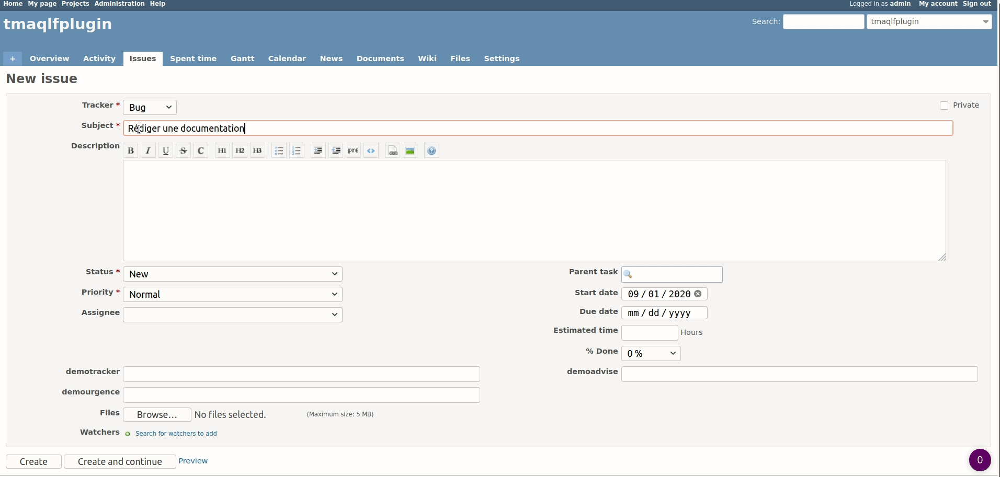
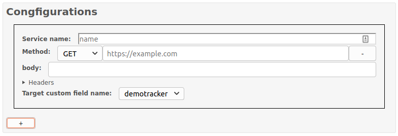
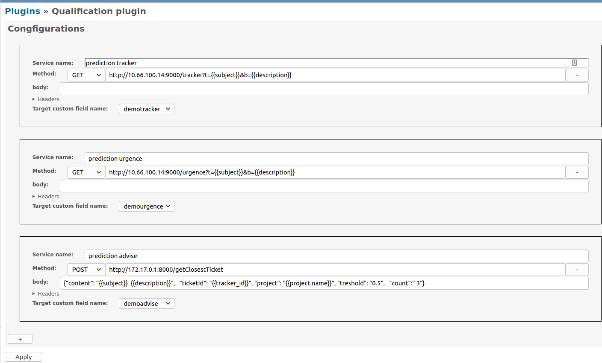
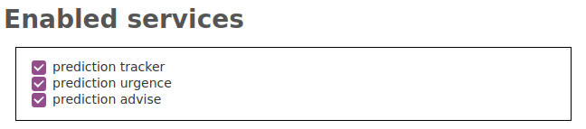

# Auto Qualification

Redmine plugin to automatically fill Redmine issue fields by fetching endpoints.



## Installation

- Clone or download this repository into your Redmine's plugins folder
- rename the directory "qualification"
- restart the Redmine server
- configure the plugin in the admin panel

## Configuration

### Service configuration

You must register the list of services wich may be called upon issue creation.
First, heads to the project configuration page (/settings/plugin/qualification).



- The service name will be displayed in the project configuration page
- The method and the url should match an existing endpoint
- A body for the request can be added (optional)
- Headers can also be added by clicking on the header dropdown and should follow the syntax key=value
- The target custom field his the custom field in which the result of the request will be saved

It is possible to insert variables inside the url and body to gather information on the issue. To insert a variable you should put his name inside double brackets. The accessible variables are the default issue fields (ex: {{subject}}) and the custom fields with the prefix "custom." (ex: {{custom.custom_field_name}}).

Here is a full example:



### Enabling auto qualification

This plugin can be enabled or disabled project wide has a redmine module (from the project's settings page).

For each project specific services can be toggled, on the project's setting page click the tab "qualification" and only check the services you want to be called upon issue creation.



## Usage

On issue creation, assuming that a service is configured, that the project has the auto qualification module enabled and that a service is enabled in the setting/qualification tab, the custom fields will be overriden by the services response.

If nothing happen, double check that the endpoints are correctly registred and return a 200 when fetch from the redmine host, [postman-echo](http://postman-echo.com/) can help you test your configuration.

## Build

For development purpose you may have to build the tsx and less sources.
This is done with yarn:

```bash
yarn #install dependencies
yarn build
```

## License

MIT
