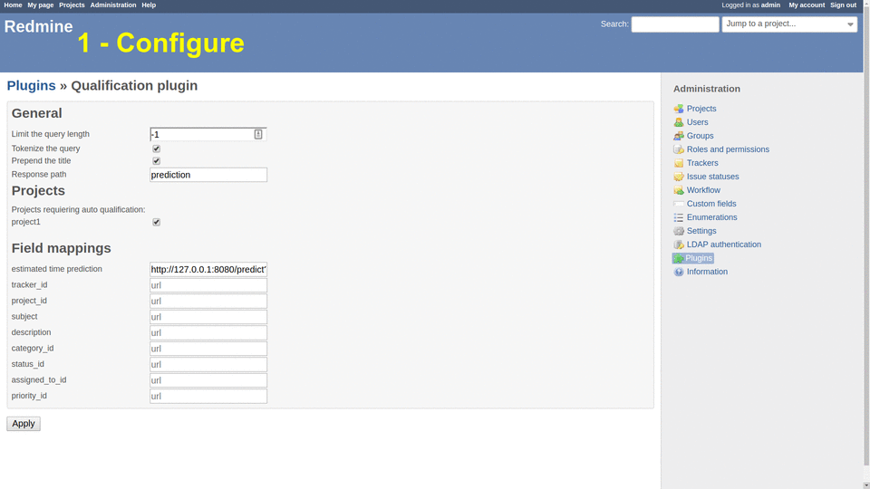

# Redmine qualification plugin

Redmine plugin to automatically fill Redmine issue fields by fetching endpoints.
You can use it to automatically qualify your tickets using machine learning, here is an example where we predict the ticket's resolution time:

You can find how to run this example in the [extra folder](extra/README.md).

## Installation

- Clone or download this repository into your Redmine's plugins folder
- restart the Redmine server
- configure the plugin in the admin panel

## Configuration

- Go to /settings/plugin/qualification and configure the plugin
  - "Limit the query length" maximum number of character sent to the endpoints
  - "Tokenize the query"  remove any non-word character
  - "Prepend the title"  prepend the title as part of the description
  - "Response path" if the end point returns {"a": {"b": "value"}} specify a.b
  - Check the projects for which the plugin will be activated
  - Map the fields you want to predict to http endpoints
  - Advanced: optional tracker_id regex mapper: Each regex mapper box correspond to a number sent by the tracker_id service. If you fill the first box with "demande" when the service answer with "0" the tracker named /demande/ will be selected.

## Endpoint requirements

The plugin currently supports GET HTTP request only. The plugin appends to the endpoint the user query which corresponds to issue_description (or if "Prepend the title" is check: issue_title + " " + issue_description).

The endpoint must return a JSON response.

## Usage with LUIS

The plugin configuration is flexible enough to be used with many existing services. Here is a quick walk-through to set up a binding with LUIS.

In this example, we will rewrite the subject to either "new functionalities", "security issue", "graphical glitch" or "logic problem" based on the ticket's description.

1. First, you should create or login into a [luis account](https://www.luis.ai/home)
2. Create a new app on [your dashboard](https://www.luis.ai/applications)
3. Create 4 intents named "new functionalities", "security issue", "graphical glitch" and "logic problem"
4. Train your model by giving it examples of ticket description for each intent
5. When your model is getting accurate click on the publish tab
6. Copy your LUIS endpoint at the bottom of the page
7. Now head to your Redmine server on the qualification configuration page (/settings/plugin/qualification)
8. Set "Limit the query length" to 499 to respect LUIS restrictions, set "Response path" to "topScoringIntent.intent" and paste the endpoint in the text box for "subject"
9. Now, when someone creates a ticket LUIS determines the best matching title and the plugin sets it automatically!
