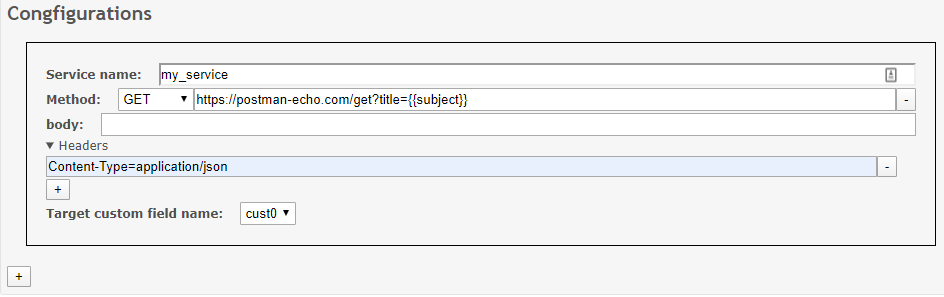

# Auto Qualification

Redmine plugin to automatically fill Redmine issue fields by fetching endpoints.

## Installation

- Clone or download this repository into your Redmine's plugins folder
- rename the directory "qualification"
- restart the Redmine server
- configure the plugin in the admin panel

## Configuration

### Service configuration

You must register the list of services wich may be called upon issue creation.
First, heads to the project configuration page (/settings/plugin/qualification).


- The service name will be displayed in the project configuration page
- The method and the url should match an existing endpoint
- A body for the request can be added (optional)
- Headers can also be added by clicking on the header dropdown and should follow the syntax key=value
- The target custom field his the custom field in which the result of the request will be saved

It is possible to insert variables inside the url and body to gather information on the issue. To insert a variable you should put his path inside dooble brackets. The variables accessible correspond to the object "context" of redmine "controller_issues_new_before_save" hook. For example, {{issue.subject}} will be replaced with the issue subject. Previously set custom field can also be reused ex: {{params.issue.custom_field_values.1}}.

Here is a full example:



### Enabling auto qualification

This plugin can be enabled or disabled project wide has a redmine module (from the project's settings page).

For each project specific services can be toggled, on the project's setting page click the tab "qualification" and only check the services you want to be called upon issue creation.

## Build

For development purpose you may have to build the tsx and less sources.
This is done with yarn:

```bash
yarn #install dependencies
yarn build
```

## License

MIT
